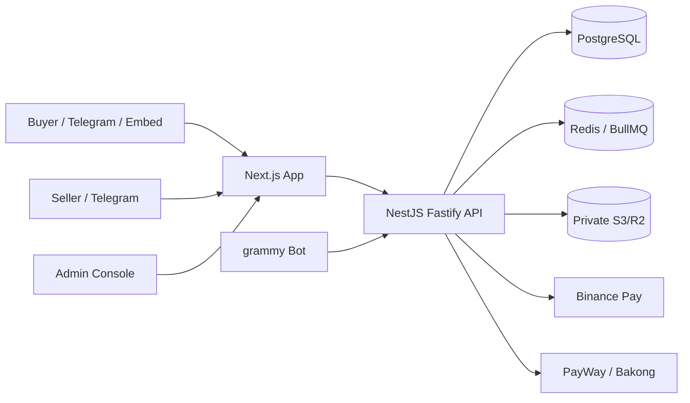

# BothSafe Architecture

BothSafe is implemented as an npm workspace with a NestJS API and a Next.js web app.

## System Shape

## Safety Boundary

BothSafe stores commercial state, entitlements, evidence, and ledger obligations. It does not treat database balances as money. Provider-confirmed payment records are the source of truth for paid/refunded/payout states, and V1 creates admin approval tasks before money release.

## Implementation Highlights

- Payment providers implement one interface with capability flags.
- Webhooks are verified, stored, and processed idempotently.
- Entitlements are the source of truth for downloads, license reveals, and subscription access.
- Ledger entries are append-only; corrections are reversal entries.
- Auto-release creates manual admin review tasks in V1.
