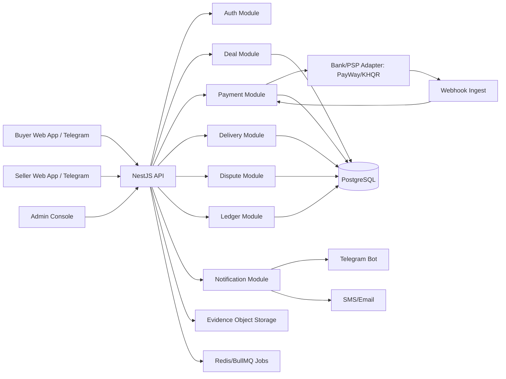

# Research Report: BothSafe Cambodia Escrow Startup Architecture

Generated: 2026-05-03  
Mode: deep-research standard + last30days social signal  
Location focus: Cambodia, starting in Phnom Penh  

## Executive Summary

- **Key Finding 1:** Cambodia has the payment rails BothSafe needs: Bakong/KHQR is a national interoperable payment layer, and PayWay exposes KHQR, pre-authorization, webhook, refund, payout, and split-payout APIs that can support an escrow-like workflow if the commercial and regulatory terms allow it [1], [2], [3], [4], [5], [6].
- **Key Finding 2:** BothSafe should not launch by directly holding customer money unless it first obtains the right NBC permissions or works under a licensed bank/payment partner, because Cambodia's payment service Prakas applies to persons providing payment services [7].
- **Key Finding 3:** The product opportunity is real but must start narrow. Cambodia's e-commerce behavior is social-commerce-heavy, while trust, payment safety, delivery, and dispute resolution remain weak points [11], [12], [13], [14], [15].
- **Key Finding 4:** The first launch should be "protected payments for social sellers" rather than a full marketplace. The last30days run found weak Cambodia-specific social data but strong adjacent evidence that escrow marketplaces face cold-start risk when they try to create listings and trust at the same time [21].

**Primary Recommendation:** Launch BothSafe V1 as a non-custodial or partner-custodial escrow workflow for high-value physical goods in Phnom Penh, using KHQR/PayWay for payment confirmation, bank/PSP controlled fund holding, OTP delivery confirmation, and an append-only transaction ledger.

**Confidence Level:** Medium-high for the architecture and launch sequence; medium for exact regulatory classification until confirmed with Cambodian counsel and the National Bank of Cambodia.

---

## Introduction

### Research Question

How should BothSafe build a Cambodia-based trusted transaction startup that lets buyers and sellers exchange money and goods safely, starting with physical product escrow and later expanding to digital products?

This matters because the product touches payments, custody, consumer trust, dispute resolution, and fraud. A wrong architecture can create legal exposure or money-loss risk. A wrong go-to-market can create the classic two-sided marketplace cold start, where buyers do not come because sellers are absent and sellers do not come because buyers are absent.

### Scope & Methodology

This research covered Cambodia's current payment infrastructure, e-commerce rules, payment-service licensing risk, consumer protection, social-commerce behavior, fraud/scam context, and comparable marketplace payment patterns. Sources included official NBC/Bakong documentation, ABA PayWay developer documentation, Cambodia legal/regulatory references, government policy documents, market reports, news on 2026 scam enforcement, and a `last30days` scan across Reddit/Hacker News/Polymarket where available.

The `last30days` scan ran on 2026-05-03 for "Cambodia escrow buyer protection marketplace Bakong KHQR." Available live sources in the environment were Reddit, Hacker News, Polymarket, and GitHub. It returned five Reddit items and no HN or Polymarket items, so I treat it as weak social signal, not as market proof [21]. The useful pattern from that weak signal is that escrow reduces trust anxiety but does not automatically solve marketplace liquidity.

### Key Assumptions

- BothSafe is incorporated or will incorporate in Cambodia and will serve Cambodian residents first.
- V1 focuses on physical goods where buyer and seller can be identified and delivery can be evidenced.
- BothSafe wants to avoid becoming an unlicensed deposit taker, e-money issuer, or payment service institution at launch.
- The MVP can start in Phnom Penh with limited categories before national expansion.
- The engineering stack can be NestJS, React/TypeScript, PostgreSQL/Supabase, object storage, Redis queues, and a payment provider abstraction.

---

## Main Analysis

### Finding 1: Cambodia's payment rails are strong enough for escrow-like checkout, but direct fund custody is the central legal risk

Bakong describes itself as the backbone of Cambodia's payment system and supports real-time fund transfers across banks and platforms [1]. NBC's KHQR integration guide describes a merchant flow where the merchant generates a KHQR code, displays it with an expiration time, and checks payment status against Bakong until the response is success, failed, not found, or expired [2]. The same guide states that a merchant-generated QR should include a unique transaction ID, timestamp, and optional additional data, and that QR timeout should generally not exceed 10 minutes [2]. That maps cleanly to BothSafe's "deal ID -> payment link -> payment confirmation" requirement.

ABA PayWay gives BothSafe a stronger starting point than a raw KHQR-only integration. PayWay's developer suite includes checkout, ABA QR, payment links, refund APIs, pre-authorization, payout, and split-payout sections [3]. PayWay's KHQR guide states that KHQR is standardized under NBC, supports payment from multiple bank apps, supports KHR and USD, and can notify merchants through a webhook after successful payment [4]. PayWay's webhook sample includes fields such as transaction ID, transaction date, original amount, payment status, bank reference, payment type, payer account, bank name, and merchant reference [4]. These fields are exactly what BothSafe needs for payment reconciliation and fraud evidence.

The caution is that KHQR payment itself is usually a completed transfer. A naive "buyer pays into BothSafe's own bank account, BothSafe later pays seller" model may become regulated custody or payment-service activity. Cambodia's Prakas on Management of Payment Service Institutions says its purpose is to regulate licensing for legal persons intending to provide payment services in Cambodia and applies to persons providing payment services as well as banking and financial institutions under NBC supervision [7]. The same Prakas defines electronic money, payment service institutions, payment accounts, payment initiation service, and trust accounts [7]. This is the product's main red line.

The practical answer is to design two launch paths. Path A is partner-custodial: BothSafe is the instruction, evidence, and dispute layer while an NBC-licensed bank or payment institution holds funds and executes capture, cancellation, refund, and payout. Path B is non-custodial protected payment: BothSafe generates payment requests and tracks commitments, but the bank/PSP controls settlement and funds. Baray's public positioning is useful as a local reference pattern because it says it is software integration middleware, not a payment gateway or financial institution, and that all payments flow through NBC-regulated bank infrastructure [23]. BothSafe should use a similar boundary unless and until it is licensed.

**Implications:** BothSafe's first engineering principle should be "never treat database balances as money." Money is wherever the licensed partner says it is. BothSafe's database records claims, instructions, evidence, and ledger events. It should reconcile against provider records before any release or refund.

**Sources:** [1], [2], [3], [4], [5], [6], [7], [23]

---

### Finding 2: PayWay's API surface can support the release/refund mechanics, but BothSafe must confirm exact product eligibility before promising escrow

PayWay's pre-authorization completion documentation defines a two-step flow: first reserve funds on the customer's account, then later capture the funds when the product or service is provided [5]. It states that pre-auth can be completed once, cannot be completed after expiration or cancellation, and for card payments can be completed with an additional 10 percent above the original pre-auth amount [5]. The cancellation documentation says cancellation releases a temporary hold when the transaction is still pending and notes that for ABA Pay and card transactions funds are instantly released back to the payer, while for KHQR transactions funds are refunded to the payer [6].

PayWay also documents payout services for distributing funds to a recipient and split-payout services for collecting, splitting, and distributing funds from purchase transactions across checkout, account/card-on-file, payment link, ABA QR API, and pre-auth products [6]. This is unusually relevant for BothSafe because the product needs three money movements: collect buyer payment, hold or delay release, and pay seller after delivery confirmation. PayWay's docs indicate that at least some of these primitives exist inside an established Cambodian bank payment stack [3], [5], [6].

However, "supports primitives" is not the same as "approved for escrow." BothSafe must confirm directly with ABA PayWay and legal counsel whether pre-auth and split-payout can be used for third-party marketplace escrow, which product types are allowed, how long funds can remain pending, whether sellers need beneficiary whitelisting, who is merchant of record, what happens when disputes exceed the pre-auth window, and whether KHQR payments can be held or only refunded after settlement. This is not a minor detail. The business model changes if PayWay can hold funds for 3 to 7 days versus if BothSafe must collect into a settlement account and then handle release manually.

The safest MVP promise is therefore "payment secured through bank partner, released after delivery confirmation" rather than "BothSafe holds your money" until the provider contract is signed. The UI can still show "Secured" or "Protected" after payment confirmation, but the terms should clearly state who holds funds, what release rules apply, and what dispute window exists.

**Implications:** Payment integration should be abstracted behind a provider interface from day one. The first provider can be ABA PayWay or another bank gateway, but the domain model should support provider capabilities: `supports_pre_auth`, `supports_split_payout`, `supports_refund`, `supports_payout`, `max_hold_duration`, `supported_currencies`, and `requires_beneficiary_whitelist`.

**Sources:** [3], [4], [5], [6]

---

### Finding 3: Cambodia's market gap is trust infrastructure around social commerce, not another generic marketplace

Cambodia's e-commerce market is still shaped by social platforms. Xinhua reported in 2025 that many Cambodian businesses rely on Facebook, TikTok, and Telegram to sell products, and that mobile payments and social commerce had the highest penetration among e-commerce sectors, exceeding 50 percent [13]. DataReportal's 2026 Cambodia report says there were 14.0 million active social media user identities in Cambodia in October 2025, equivalent to 77.9 percent of the population [11]. Cambodianess reported that Cambodia had 11.65 million Facebook users and 9.96 million TikTok users in 2024, with e-commerce contributing $1.51 billion or 6.68 percent to GDP, while fraud, poor product quality, high delivery fees, logistics bottlenecks, and limited digital literacy remained constraints [15].

This creates a sharp product strategy. BothSafe should not begin by asking Cambodians to abandon Facebook, Telegram, TikTok, or direct chat selling. It should begin as the trusted transaction link used inside those channels. A seller can create a deal, share a BothSafe link in Telegram/Facebook chat, and let the buyer pay into a protected flow. This avoids building demand, listings, search, chat, logistics, and trust all at once.

The last30days run reinforces that risk. One recent Reddit item was from a builder who created a local marketplace with escrow payments and AI pricing but had "zero buyers," despite trying to solve no-shows, cash, Venmo, and trust [21]. That is only one item and not Cambodia-specific, so it should not be overweighted. But it matches a known marketplace lesson: escrow is valuable at the moment of transaction, while a marketplace needs liquidity before transactions happen.

Tokkae's Cambodia marketplace analysis is not official, but it matches the same pattern: social commerce gives reach but lacks buyer protection, seller verification, order tracking, and dispute resolution [14]. BothSafe's first beachhead should be those missing trust primitives layered over existing social commerce.

**Implications:** The MVP should be a transaction layer, not a marketplace. Build deal links, payment protection, seller verification, delivery proof, notifications, and disputes first. Add marketplace discovery only after there are enough completed protected transactions to seed trusted seller profiles.

**Sources:** [11], [13], [14], [15], [21]

---

### Finding 4: Cambodia's legal environment supports e-commerce growth, but BothSafe needs licensing, terms, consumer disclosure, and data controls before launch

Cambodia's Law on Electronic Commerce was enacted in 2019 and provides a legal framework for electronic records, electronic signatures, electronic contracts, intermediary liability, electronic payments, and consumer-facing digital commerce [8]. The law includes a chapter on intermediaries and electronic commerce service providers, with conditional liability protection when the service provider is not the originator of unlawful information and acts appropriately once aware of unlawful content [8]. This matters because BothSafe will host deal descriptions, product photos, messages, evidence, and dispute claims.

The Library of Congress summary of Cambodia's e-commerce licensing regime says the E-Commerce Law created two categories: an e-commerce permit for individual persons and sole proprietorships and an e-commerce license for legal persons and branches of foreign companies [9]. It also says Sub-Decree No. 134 applies to operations in Cambodia, services from Cambodia to other countries, and services from other countries to Cambodia, and that e-commerce platforms are among activities requiring a license [9]. BothSafe should assume it needs the relevant Ministry of Commerce e-commerce license or permit before public launch.

Cambodia also enacted a Consumer Protection Law on November 2, 2019 [10]. Tilleke & Gibbins notes that both the e-commerce and consumer protection laws changed the legal landscape for businesses and that financial institutions can become liable for unauthorized transactions after a customer notification about a lost or stolen electronic payment instrument [10]. For BothSafe, the broader point is that refund rules, complaint handling, product description accuracy, dispute process fairness, and standard terms are not "nice to have." They are part of the trust product.

Cambodia does not yet have a comprehensive enacted personal data protection law as of the latest guide reviewed, although draft personal data protection law consultations have occurred [20]. That does not mean BothSafe can ignore privacy. Payment, identity, chat, product evidence, delivery photos, and dispute files are sensitive. A startup touching money should behave as if stronger data-protection obligations are coming: minimize data, encrypt sensitive fields, apply role-based access, log admin access, and define retention periods.

**Implications:** Before launch, BothSafe needs a legal readiness workstream: company registration, domain and e-commerce licensing, payment partner agreement, terms of service, privacy notice, buyer/seller agreement, prohibited items policy, dispute policy, AML/KYC policy if required by partner or regulator, and data retention schedule.

**Sources:** [8], [9], [10], [20]

---

### Finding 5: Fraud context is a brand risk and a product requirement, not only a compliance issue

Cambodia is under intense scrutiny for online scams in 2026. AP reported in March 2026 that Cambodian officials said they had targeted 250 suspected scam-center locations since July and shut about 80 percent, or 200, of them [18]. The same AP report quoted an expert warning that enforcement must reach the financial and protection networks behind the industry, not just the buildings [18]. TRC also warned in September 2025 that fraudulent Telegram messages were rising, including impersonation of public figures and business leaders, fake prize messages, and phishing for passwords or financial information [16].

BothSafe should treat this as a product-design constraint. A Cambodian escrow brand can either become a trust-building counterexample or be misused by scammers. The MVP must prevent fake payment confirmations, fake BothSafe links, fake seller profiles, and off-platform pressure. Every deal link needs a signed short URL, public verification page, anti-phishing education, and a simple way for users to check "is this deal real?" from the app or Telegram bot.

The dispute system must be evidence-first. For physical goods, the strongest evidence is a chain of custody: seller proof of item, pickup proof, courier proof, delivery OTP, buyer confirmation, and timestamped photos. For pickup/meetup deals, the product should use a handover OTP or QR confirmation that both parties see at the same time. Never let "seller uploaded a screenshot" count as payment proof; payment proof should come from provider webhook plus reconciliation polling.

**Implications:** Fraud controls should ship in V1, not after growth. The product should include phone verification, device/session logging, transaction limits for new users, seller verification tiers, high-risk category restrictions, link authenticity checks, payment reconciliation, evidence uploads, manual review queues, and admin audit logs.

**Sources:** [16], [18], [21]

---

### Finding 6: The technical architecture should separate deal state, payment state, ledger state, delivery state, and dispute state

Escrow products fail when they store a single `status` string and let that string imply money movement. BothSafe should separate five state machines. Deal state describes commercial agreement. Payment state describes provider confirmation. Ledger state records accounting events. Delivery state records shipment and handover proof. Dispute state controls whether release is allowed.

The payment provider state should be webhook-driven and reconciled by scheduled polling. NBC's KHQR integration flow explicitly describes status checking within a QR expiration window, and PayWay's KHQR guide supports webhook notification after successful payment [2], [4]. The architecture should therefore use both push and pull: webhooks for fast updates, reconciliation jobs for correctness. Every inbound webhook should be stored raw, verified, idempotently processed, and linked to a provider transaction.

The ledger should be append-only. Even if the MVP does not legally hold funds, it still needs a ledger of obligations: buyer paid, funds protected with provider, seller payable pending release, platform fee earned, refund pending, refund completed, payout requested, payout completed. This ledger is not a bank balance. It is an audit trail and reconciliation record. Each event should have an idempotency key, source event, actor, timestamp, and before/after state.

The admin system should be treated as a privileged financial operations tool. Admins must not be able to silently edit deal amounts, payment statuses, or ledger rows. They can create decisions, approve refunds or releases, and annotate disputes, but all changes must produce immutable events. For production, high-risk decisions should require maker-checker review: one admin proposes, another approves.

**Implications:** Build the architecture as a modular monolith first, not microservices. Use NestJS modules with clear boundaries and a shared PostgreSQL transaction where needed. Split into services later only when volume forces it.

**Sources:** [2], [4], [5], [6], [17], [19]

---

## Recommended Product Strategy

### Beachhead

Start with protected social-commerce transactions for high-value physical goods in Phnom Penh. Good first categories are used phones, laptops, cameras, electronics accessories, and small business inventory lots. Avoid cars, real estate, regulated financial products, weapons, medicine, crypto, gambling, and high-risk digital accounts at launch.

### Positioning

Use "BothSafe protected deal" rather than "escrow bank" in early wording. The promise is simple:

1. Buyer and seller agree on item, price, delivery method, and inspection window.
2. Buyer pays through a protected bank/payment partner flow.
3. Seller ships or hands over only after payment is secured.
4. Buyer confirms receipt or raises an issue within the inspection window.
5. Money is released, refunded, or escalated based on rules and evidence.

### Launch Motion

Do not start with open marketplace discovery. Start with:

- Telegram bot and web link for deal creation.
- Seller verification for trusted early sellers.
- Manual concierge onboarding for 20 to 50 sellers.
- A narrow category campaign: "Buy used phones safely in Phnom Penh."
- Courier/meetup delivery proof with OTP.
- Visible dispute rules and human admin support.

---

## Target Architecture

### High-Level System



### Backend Modules

- `AuthModule`: phone/email/Telegram login, sessions, device records, 2FA for admins.
- `UserModule`: profile, verification tier, trust score, seller payout profile, risk flags.
- `DealModule`: deal creation, counterparty invite, terms, item, price, status.
- `PaymentModule`: provider abstraction, payment intent, KHQR/payment link generation, webhook ingestion, reconciliation, refund, payout.
- `LedgerModule`: append-only double-entry-like obligation ledger.
- `DeliveryModule`: shipping method, pickup/dropoff proof, OTP, buyer receipt confirmation.
- `DisputeModule`: issue reason, evidence, response, admin decision, release/refund instruction.
- `NotificationModule`: Telegram, SMS, email, in-app notifications.
- `DigitalProductModule` (V2): uploads, encrypted storage, signed downloads, license keys.
- `AdminModule`: dashboard, dispute queue, risk review, manual release/refund approvals.

### Frontend Apps

- Buyer/seller web app: React + TypeScript.
- Admin console: React + TypeScript, separate route and stricter auth.
- Telegram bot: create deals, send payment links, notify status changes, confirm delivery.

### Infrastructure

- PostgreSQL: source of truth.
- Supabase: acceptable for Postgres, Auth, storage, and realtime in MVP, but use strict row-level security and service-role isolation.
- Redis + BullMQ: payment reconciliation jobs, auto-release timers, notification retries.
- S3-compatible object storage: evidence photos, invoices, digital files in V2.
- OpenTelemetry + structured logs: trace every deal, payment, webhook, and admin decision.

---

## Core Data Model

### Tables

```text
users
- id, phone, email, telegram_id, display_name, role, verification_level
- trust_score, risk_score, status, created_at

user_verifications
- id, user_id, type, provider, status, verified_at, metadata_json

deals
- id, public_code, buyer_id, seller_id, title, description
- currency, amount_minor, fee_minor, category, inspection_window_hours
- status, expires_at, created_at, updated_at

deal_terms
- id, deal_id, delivery_method, delivery_address_json
- item_condition, return_rules, prohibited_item_check, accepted_at

payment_intents
- id, deal_id, provider, provider_intent_id, provider_reference
- amount_minor, currency, status, qr_payload, payment_url
- expires_at, confirmed_at, raw_provider_json

payment_events
- id, payment_intent_id, provider_event_id, event_type
- raw_payload_json, signature_valid, processed_at, idempotency_key

ledger_entries
- id, deal_id, entry_type, debit_account, credit_account
- amount_minor, currency, provider_reference, source_event_id
- created_by, created_at

deliveries
- id, deal_id, method, courier_provider, tracking_number
- status, shipped_at, delivered_at, buyer_confirmed_at

delivery_evidence
- id, delivery_id, actor_id, evidence_type, object_url
- metadata_json, created_at

disputes
- id, deal_id, opened_by, reason, status, resolution
- admin_decision, decided_by, decided_at, created_at

dispute_messages
- id, dispute_id, sender_id, message, evidence_url, created_at

payouts
- id, deal_id, seller_id, provider, provider_payout_id
- amount_minor, currency, status, requested_at, completed_at

audit_events
- id, actor_id, actor_type, action, entity_type, entity_id
- before_json, after_json, ip_address, user_agent, created_at
```

### State Machines

Deal status:

```text
DRAFT
PENDING_COUNTERPARTY
PENDING_PAYMENT
PAYMENT_SECURED
SELLER_TO_SHIP
SHIPPED
DELIVERED
INSPECTION
RELEASE_PENDING
COMPLETED
DISPUTED
REFUND_PENDING
REFUNDED
CANCELLED
EXPIRED
```

Payment status:

```text
CREATED
PENDING
AUTHORIZED
PAID
FAILED
EXPIRED
CANCELLED
REFUND_PENDING
REFUNDED
RELEASE_REQUESTED
RELEASED
```

Dispute status:

```text
NONE
OPEN
AWAITING_BUYER_EVIDENCE
AWAITING_SELLER_RESPONSE
ADMIN_REVIEW
RESOLVED_RELEASE
RESOLVED_REFUND
RESOLVED_SPLIT
ESCALATED
```

---

## Payment Flow V1

### Create Deal

1. Seller or buyer creates a deal with item name, price, photos, delivery method, inspection window, and counterparty phone/Telegram.
2. BothSafe generates a public deal code and invite link.
3. Counterparty reviews and accepts terms.
4. Deal moves to `PENDING_PAYMENT`.

### Secure Payment

1. BothSafe creates a payment intent through the provider adapter.
2. Provider returns a dynamic KHQR/payment link or pre-auth flow.
3. Buyer pays through bank app.
4. Provider webhook arrives.
5. BothSafe verifies webhook, stores raw payload, checks idempotency, and updates payment state.
6. Reconciliation job polls provider if webhook is delayed.
7. Deal moves to `PAYMENT_SECURED`.

### Ship and Confirm

1. Seller sees `PAYMENT_SECURED` and ships or meets buyer.
2. Seller marks shipped and uploads evidence.
3. Courier or buyer uses OTP/QR handover.
4. Buyer confirms receipt.
5. Deal enters `INSPECTION` for 24 to 72 hours depending on category.

### Release

1. If buyer confirms and no dispute exists, release job creates a payout/release instruction.
2. Provider releases/captures/transfers/pays seller depending on commercial setup.
3. BothSafe records provider result and ledger entries.
4. Deal moves to `COMPLETED`.

### Dispute

1. Buyer clicks "Report issue" before inspection window expires.
2. Release is frozen.
3. Buyer chooses reason: not received, damaged, wrong item, counterfeit, incomplete, other.
4. Seller responds with evidence.
5. Admin decides: release, refund, partial split, request more evidence, or escalate.
6. PaymentModule executes provider refund/release/payout based on decision.

---

## Security and Reliability Requirements

### Money Safety

- Never process release from client-side confirmation alone.
- Require provider-confirmed payment state before shipping status can advance.
- Use idempotency keys for all payment intent, refund, and payout operations.
- Store all provider webhooks before processing.
- Reconcile provider transactions on a schedule.
- Use maker-checker review for manual refund/release above threshold.
- Keep ledger append-only; use reversal entries rather than edits.

### Fraud Prevention

- Phone verification for all users.
- Seller verification tiers with higher limits for verified users.
- New-user transaction limits.
- Device fingerprint and session history.
- Prohibited categories and keyword/photo review.
- Public deal verification page to fight fake links.
- Payment proof only from provider, never screenshots.
- Admin risk queue for high-value deals or repeated disputes.

### Data Protection

- Encrypt sensitive personal data and evidence metadata.
- Store payment secrets in a secrets manager.
- Limit admin access by role.
- Log every admin view/action on user, deal, payment, and dispute data.
- Set retention rules: ordinary evidence 180 days after completion; dispute evidence 2 to 5 years depending on counsel guidance.

### Reliability

- Use queues for notification, reconciliation, auto-expiry, auto-release.
- Use transactional outbox for domain events.
- Use database constraints for state transitions.
- Monitor webhook failure rate, payout failure rate, dispute SLA, and reconciliation mismatches.

---

## Digital Products V2

V2 should start only after V1 payment and dispute operations are stable. Digital goods have lower delivery cost but higher fraud risk because the seller can send invalid files, duplicate license keys, hacked accounts, or non-transferable accounts.

Digital V2 architecture:

- Seller uploads file to private object storage.
- BothSafe virus-scans file and stores hash.
- Buyer pays.
- Access grant is created only after payment secured.
- Buyer downloads through signed URL with expiry, device/session logging, and download limit.
- License keys are encrypted at rest and revealed once.
- Seller payout releases after buyer confirms or after a shorter auto-release window.

Avoid account/service resale at first. Start with low-risk files such as templates, eBooks, course files, design assets, and software licenses where seller rights can be documented.

---

## Implementation Plan

### Phase 0: Legal and Partner Readiness - Week 1 to 2

1. Register company and tax profile.
2. Confirm e-commerce permit/license requirement with Ministry of Commerce counsel.
3. Meet ABA PayWay, Wing, ACLEDA, PPCBank, and at least one KHQR middleware provider.
4. Ask each provider:
   - Can you support marketplace escrow or protected payment?
   - Who legally holds funds?
   - Can funds be held before seller payout?
   - Maximum hold/authorization duration?
   - Can KHQR be pre-authorized, or only paid/refunded?
   - Are split payouts available for marketplace sellers?
   - What KYC is required for sellers?
   - What dispute/refund workflow is allowed?
5. Choose launch payment model:
   - Preferred: bank/PSP controlled protected funds with release/refund API.
   - Fallback: pre-auth for supported methods and manual bank-controlled settlement.
6. Draft terms, privacy policy, buyer/seller agreement, prohibited item policy, dispute policy, fee schedule.

Exit criteria: signed sandbox access, written payment flow approval, legal memo on custody/licensing risk.

### Phase 1: Technical Foundation - Week 2 to 4

1. Scaffold NestJS API.
2. Add PostgreSQL migrations.
3. Add AuthModule with phone/email/Telegram identity.
4. Add UserModule and roles.
5. Add DealModule with deal creation and acceptance.
6. Add AuditModule and immutable audit events.
7. Add object storage for product photos and evidence.
8. Add basic React app with create deal, join deal, dashboard.
9. Add admin console skeleton.

Exit criteria: user can create and join a deal in staging; all state changes audited.

### Phase 2: Payment MVP - Week 4 to 6

1. Build `PaymentProvider` interface:
   - `createIntent`
   - `getIntent`
   - `handleWebhook`
   - `cancelOrRefund`
   - `releaseOrPayout`
   - `reconcile`
2. Implement sandbox adapter for chosen provider.
3. Generate payment link/KHQR.
4. Verify webhook signatures or provider authentication method.
5. Store raw webhooks.
6. Implement idempotency.
7. Implement reconciliation polling.
8. Implement ledger entries for secured, refund pending, released, refunded, fee earned.

Exit criteria: sandbox payment can move deal from `PENDING_PAYMENT` to `PAYMENT_SECURED` and ledger balances reconcile.

### Phase 3: Delivery and Confirmation - Week 6 to 8

1. Add delivery method: meetup, seller delivery, courier delivery.
2. Add OTP/QR handover confirmation.
3. Add seller shipped flow.
4. Add buyer received flow.
5. Add inspection timer.
6. Add auto-release job after inspection window if no dispute.
7. Add notifications through Telegram and email/SMS.

Exit criteria: physical deal can complete end-to-end in staging with delivery evidence and release instruction.

### Phase 4: Disputes and Admin Operations - Week 8 to 10

1. Add dispute open flow.
2. Add dispute evidence upload.
3. Add seller response.
4. Add admin dispute queue.
5. Add admin decision types: release, refund, split, request evidence.
6. Add maker-checker for high-value decisions.
7. Add dispute SLA dashboard.
8. Add canned Khmer/English communication templates.

Exit criteria: disputed deal freezes release and can be resolved with an audited decision.

### Phase 5: Private Beta - Week 10 to 12

1. Recruit 20 to 50 sellers in one category.
2. Set transaction limits:
   - New users: low cap.
   - Verified sellers: higher cap.
   - Manual review above threshold.
3. Run 100 concierge-supported deals.
4. Track:
   - Payment success rate.
   - Payment confirmation time.
   - Delivery confirmation rate.
   - Dispute rate.
   - Refund rate.
   - Release time.
   - Support tickets per deal.
5. Interview buyers and sellers after every disputed deal.

Exit criteria: at least 80 completed deals, dispute rate understood, zero unreconciled money events, support workflow stable.

### Phase 6: Public MVP - Month 4 to 6

1. Launch Telegram bot.
2. Launch seller verification badges.
3. Launch public deal verification page.
4. Launch fee model:
   - Buyer fee or seller fee per deal.
   - Optional rush dispute review.
   - Optional verified seller subscription later.
5. Add referral program for trusted sellers.
6. Add category expansion only after operational metrics are stable.

Exit criteria: repeat sellers, organic buyer invites, stable dispute SLA, positive completed transaction rate.

---

## API Surface

```text
POST /auth/login
POST /auth/telegram
GET  /me

POST /deals
GET  /deals/:id
POST /deals/:id/accept
POST /deals/:id/cancel

POST /deals/:id/payment-intents
GET  /payment-intents/:id
POST /webhooks/payway

POST /deals/:id/mark-shipped
POST /deals/:id/delivery-evidence
POST /deals/:id/confirm-received

POST /deals/:id/disputes
POST /disputes/:id/messages
POST /admin/disputes/:id/decision

GET  /admin/deals
GET  /admin/payments/reconciliation
GET  /admin/metrics
```

---

## Trust Score V1

Start simple. Do not pretend to have a magic AI trust score.

Inputs:

- Verified phone.
- Verified Telegram.
- Completed deals.
- Cancelled deals.
- Disputes opened.
- Disputes lost.
- Average response time.
- Seller evidence completeness.
- Admin risk flags.

Display:

- "New"
- "Verified"
- "Trusted seller"
- "High-value verified"

Avoid showing exact numeric risk scores to users because scammers can game them.

---

## Metrics

### Product Metrics

- Created deals.
- Accepted deals.
- Payment conversion.
- Payment confirmation median time.
- Shipped after secured payment.
- Buyer confirmation rate.
- Auto-release rate.
- Dispute rate.
- Refund rate.
- Repeat seller rate.
- Repeat buyer rate.

### Risk Metrics

- Unreconciled provider transactions.
- Manual release/refund count.
- High-risk category attempts.
- Disputes per seller.
- Disputes per buyer.
- Fake link reports.
- Chargeback/refund loss.

### Business Metrics

- Gross transaction value.
- Net revenue.
- Take rate.
- Support cost per transaction.
- Average transaction value.
- Seller acquisition cost.
- Buyer invite conversion.

---

## Synthesis & Insights

BothSafe should be built as a trust layer before it becomes a marketplace. Cambodia's payment rails and social commerce adoption are strong, but social commerce lacks the infrastructure that makes strangers comfortable transacting: verified counterparties, secure payment confirmation, delivery proof, and disputes. The fastest route is to meet users inside their existing behavior. A Telegram-first deal link is more natural than asking everyone to browse a new marketplace on day one.

The most important architecture decision is legal, not technical. The database should never be the authority on money. The payment provider is the authority. BothSafe should record provider-confirmed events, create release/refund instructions, preserve evidence, and maintain an audit ledger. This keeps the product scalable and makes it easier to explain to banks and regulators.

The second important decision is operational. Escrow creates disputes by design because it gives buyers a way to object and sellers a way to demand evidence. That is the product. If BothSafe cannot resolve disputes quickly, fairly, and consistently, the brand will lose trust. Therefore, the admin console, evidence model, release freeze, and decision audit trail are MVP features, not back-office extras.

The third decision is category focus. High-value goods create enough pain to justify a fee. Low-value goods will not support the operational cost of human disputes. Start with categories where fraud anxiety is high and evidence is practical: phones, laptops, cameras, electronics, and small inventory lots. Do not start with services, account sales, crypto, vehicles, or medicines.

---

## Limitations & Caveats

### Counterevidence Register

The weak point in this research is direct Cambodia-specific social evidence for escrow demand. The `last30days` run found only five Reddit items, and most were adjacent or non-Cambodia-specific [21]. This means BothSafe should not treat public social chatter as proof of demand. It should validate with direct interviews, concierge deals, seller pilots, and paid experiments.

The second uncertainty is payment partner capability. Public PayWay documentation shows promising APIs for pre-auth, cancellation, refund, payout, and split payout [3], [5], [6]. It does not by itself prove that ABA will approve BothSafe's intended escrow use case for all payment methods or categories. Provider approval is a launch blocker.

The third uncertainty is licensing classification. The Prakas language is broad enough that BothSafe should assume payment-service scrutiny if it holds, transfers, or controls customer funds [7]. The correct answer depends on actual money flow, contracts, and operations. Get counsel before touching live funds.

### Known Gaps

- No provider commercial agreement reviewed.
- No Cambodian legal opinion reviewed.
- No direct interviews with Cambodian buyers/sellers yet.
- No logistics partner SLA reviewed.
- No verified MoC/NBC guidance specific to escrow marketplace products found in public sources.

### Assumptions

The plan assumes a bank or PSP will support a controlled release/refund flow. If no provider supports it, BothSafe must either pursue licensing, launch as a manual concierge service under a partner's custody model, or narrow to a non-custodial trust workflow that confirms payment but does not hold funds.

---

## Recommendations

### Immediate Actions

1. Book meetings with ABA PayWay, Wing, ACLEDA, PPCBank, and Baray-style middleware providers.
2. Ask counsel to classify three money-flow models: direct custody, partner-custody, and non-custodial software layer.
3. Build clickable prototype for seller creates deal, buyer pays, seller ships, buyer confirms, seller paid.
4. Recruit 20 sellers in one high-value category before writing marketplace discovery features.
5. Draft terms and dispute rules before private beta.

### Technical Next Steps

1. Scaffold NestJS modular monolith.
2. Create PostgreSQL schema and state transition constraints.
3. Build PayWay sandbox adapter behind a provider interface.
4. Build Telegram bot for deal links and notifications.
5. Build admin dispute console before public beta.

### Research Still Needed

1. Provider hold-duration and settlement rules.
2. Seller KYC requirements.
3. E-commerce license cost and processing time.
4. Courier partner APIs and proof-of-delivery quality.
5. User interviews with buyers and sellers who currently transact via Facebook, Telegram, and TikTok.

---

## Claims-Evidence Table

| Claim | Evidence | Confidence | Build Decision |
|---|---|---:|---|
| Cambodia has suitable instant-payment rails for protected checkout. | Bakong supports real-time interbank transfers, and KHQR integration supports dynamic QR, unique transaction IDs, expiry, and status checks [1], [2]. | High | Use KHQR/payment links for V1 payment initiation. |
| BothSafe should not directly hold funds at launch. | Payment service activity is regulated by NBC's payment service Prakas, and the Prakas applies to persons providing payment services [7]. | High | Launch through a licensed bank/PSP custody model or non-custodial integration model. |
| PayWay is the strongest first provider candidate. | PayWay documents KHQR, webhooks, pre-auth completion/cancellation, refunds, payout, and split-payout APIs [3], [4], [5], [6]. | Medium-high | Build provider abstraction around PayWay sandbox first. |
| Social commerce is the right initial distribution channel. | Cambodia has 14.0 million active social media user identities, and social commerce/mobile payments have high penetration [11], [13]. | High | Launch deal links and Telegram bot before marketplace discovery. |
| Trust infrastructure is the product wedge. | Cambodia social commerce lacks consistent buyer protection, seller verification, order tracking, and dispute resolution, while fraud and delivery issues remain market constraints [14], [15], [16]. | Medium-high | Sell "protected deal" workflow, not a generic marketplace. |
| Disputes and audit trail must be MVP features. | Escrow/payment products need release, refund, and dispute handling; Stripe's marketplace docs show disputes/refunds can become platform liabilities depending on payment model [17], [19]. | High | Build admin dispute console and immutable ledger before public beta. |
| Cambodia's scam context increases both demand and misuse risk. | TRC warned about Telegram fraud, and AP reported major 2026 scam-center enforcement with continued concerns about financial networks [16], [18]. | High | Add fake-link checks, verified deal pages, risk review, and no-screenshot payment proof. |

---

## Bibliography

[1] National Bank of Cambodia. "Bakong - The Next-Generation Mobile Payments." https://bakong.nbc.gov.kh/en/ (Retrieved: 2026-05-03)

[2] National Bank of Cambodia. "Bakong QR Pay Integration." https://bakong.nbc.gov.kh/en/download/KHQR/integration/QR%20Payment%20Integration.pdf (Retrieved: 2026-05-03)

[3] ABA PayWay. "Developer Suite Overview." https://developer.payway.com.kh/ (Retrieved: 2026-05-03)

[4] ABA PayWay. "KHQR Guideline." https://developer.payway.com.kh/khqr-guideline-3192101f0 (Retrieved: 2026-05-03)

[5] ABA PayWay. "Complete pre-auth transactions." https://developer.payway.com.kh/complete-pre-auth-transactions-14530835e0 (Retrieved: 2026-05-03)

[6] ABA PayWay. "Cancel pre-purchase transaction" and "Payout." https://developer.payway.com.kh/cancel-pre-purchase-transaction-14530836e0 and https://developer.payway.com.kh/payout-3158153f0 (Retrieved: 2026-05-03)

[7] Cambodia National Trade Repository. "Prakas on the Management of Payment Service Institution." https://cambodiantr.gov.kh/en/document/?title=prakas-on-the-management-of-payment-service-institution (Retrieved: 2026-05-03)

[8] Royal Government of Cambodia. "Law on Electronic Commerce." https://www.khmersme.gov.kh/wp-content/uploads/2022/06/Law-on-E-commerce-EN.pdf (Retrieved: 2026-05-03)

[9] Library of Congress. "Cambodia: Ministry of Commerce Launches New Licensing Regime for E-commerce Businesses." https://www.loc.gov/item/global-legal-monitor/2021-08-29/cambodia-ministry-of-commerce-launches-new-licensing-regime-for-e-commerce-businesses/ (Retrieved: 2026-05-03)

[10] Tilleke & Gibbins. "Cambodia Enacts a New E-commerce Law and a Consumer Protection Law." https://www.tilleke.com/insights/cambodia-enacts-new-e-commerce-law-and-consumer-protection-law/ (Retrieved: 2026-05-03)

[11] DataReportal. "Digital 2026: Cambodia." https://datareportal.com/reports/digital-2026-cambodia (Retrieved: 2026-05-03)

[12] Royal Government of Cambodia. "Cambodia Digital Economy and Society Policy Framework 2021-2035." https://itd.mef.gov.kh/assets/uploads/2021/08/Digital-Economy-and-Society-Framework-EN.pdf (Retrieved: 2026-05-03)

[13] Xinhua. "E-commerce thrives in Cambodia." https://english.news.cn/20250225/94c1b73ef92d42259165bb97f538cf46/c.html (Retrieved: 2026-05-03)

[14] Tokkae. "Will Lazada and Shopee Ever Launch in Cambodia? (2026)." https://www.tokkae.com/blog/lazada-shopee-cambodia-2026 (Retrieved: 2026-05-03)

[15] Cambodianess. "Cambodia's E-Commerce Boom Set to Top $1.78B by 2025." https://cambodianess.com/article/cambodias-e-commerce-boom-set-to-top-178b-by-2025 (Retrieved: 2026-05-03)

[16] Telecommunication Regulator of Cambodia. "Announcement on Rising Incidents of Fraudulent Activities on Telegram." https://www.trc.gov.kh/en/media/news-releases/7-news-release (Retrieved: 2026-05-03)

[17] Stripe. "Accept a payment using separate charges and transfers." https://docs.stripe.com/connect/marketplace/tasks/accept-payment/separate-charges-and-transfers (Retrieved: 2026-05-03)

[18] Associated Press. "Cambodia aims to shut down all online scam centers within weeks." https://apnews.com/article/cambodia-cybercrime-phnom-penh-online-fraud-9bbfe6ee970b5a73529f5f820b931e1f (Retrieved: 2026-05-03)

[19] Stripe. "Handle refunds and disputes." https://docs.stripe.com/connect/marketplace/tasks/refunds-disputes (Retrieved: 2026-05-03)

[20] Multilaw and Tilleke & Gibbins. "Data Protection Guide: Cambodia." https://multilaw.com/Multilaw/Multilaw/Data_Protection_Laws_Guide/DataProtection_Guide_Cambodia.aspx (Retrieved: 2026-05-03)

[21] last30days local run. "Cambodia escrow buyer protection marketplace Bakong KHQR." /home/rayu/Documents/Last30Days/cambodia-escrow-buyer-protection-marketplace-bakong-khqr-raw-bothsafe.md (Generated: 2026-05-03)

[22] Phnom Penh Post. "Bakong money transfers, payments exceed 1.3 billion transactions." https://www.phnompenhpost.com/business/bakong-money-transfers-payments-exceed-1-3-billion-transactions (Retrieved: 2026-05-03)

[23] Baray. "Bank API Integration Service for Cambodia." https://baray.io/ (Retrieved: 2026-05-03)

---

## Methodology Appendix

Research used current web retrieval because payment rails, regulations, and scam enforcement are time-sensitive. Priority was given to official sources from NBC/Bakong, PayWay, the Cambodia National Trade Repository, the Royal Government of Cambodia, TRC, and the Library of Congress. Market and social-commerce evidence used DataReportal, Xinhua, Cambodianess, Tokkae, and AP News. Architecture recommendations were synthesized from these Cambodia-specific sources plus general marketplace payment patterns from Stripe documentation.

The `last30days` skill was run with a custom query plan and targeted subreddits. It returned limited evidence, so it was used only for directional product insight and cold-start caution. The saved raw file was updated with a WebSearch supplemental appendix for traceability.

This report is not legal advice. BothSafe should obtain a Cambodia-specific legal opinion before launching any live-money flow.
